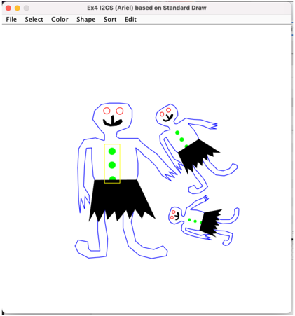

# Intro to Computer Science Assignments

This repository contains the assignments for the "Intro to Computer Science" course. Each assignment is named `Ex1` to `Ex4`.

## Assignments

- **Ex1**: Algorithm for finding the greatest prime divisor of two numbers can be divided into two parts.
- **Ex2**: This class represents a set of functions on a polynom - represented as array of doubles. In general, such an array {-1,2,3.1} represents the following polynom 3.1x^2+2x-1=0, The index of the entry represents the power of x. This Ex includes a GUI for the polynom class.
- **Ex3**: Implementation of various graphical functions and pathfinding algorithms.
    - **drawSegment**: This function takes two points and a color, and draws a line connecting them with the selected color.
    - **drawRect**: This function takes two points and a color. It draws a rectangle defined by the two points at its opposite vertices with the selected color.
    - **drawCircle**: This function takes one point, a radius, and a color. It draws a circle defined by the point at its center and the radius with the selected color.
    - **fill**: There are two versions of this function. The first takes a point and a color, and the second takes two integers representing the x and y coordinates of the point and a color. Both functions fill the point and its neighbors that had the same color as the point with the new color. The function returns the number of points that changed their color.
    - **shortestPath**: This function takes two points and returns an array of points representing the shortest (non-diagonal) path between the two points. If there is no path, the function returns null.
    - **shortestPathDist**: This function takes two points and returns the length of the shortest path between them. If no path exists, it returns 0.
    - **nextGenGol**: This function computes the next state in Conway's Game of Life based on the current map.
- **Ex4**: This project is a GUI Shape application for the "Intro to Computer Science" course as can be seen in the following screenshot.

